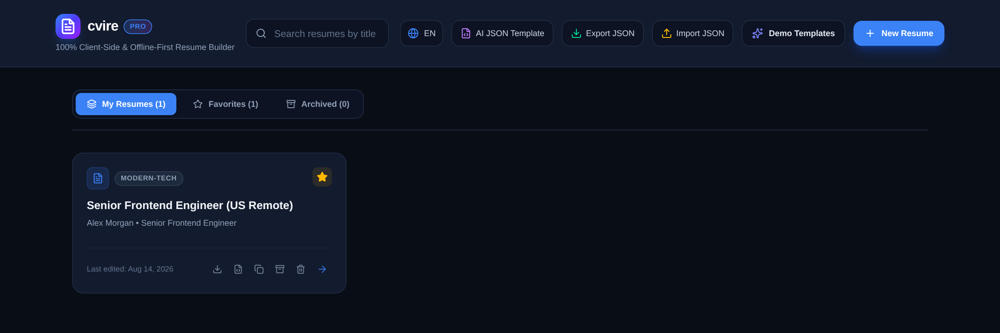
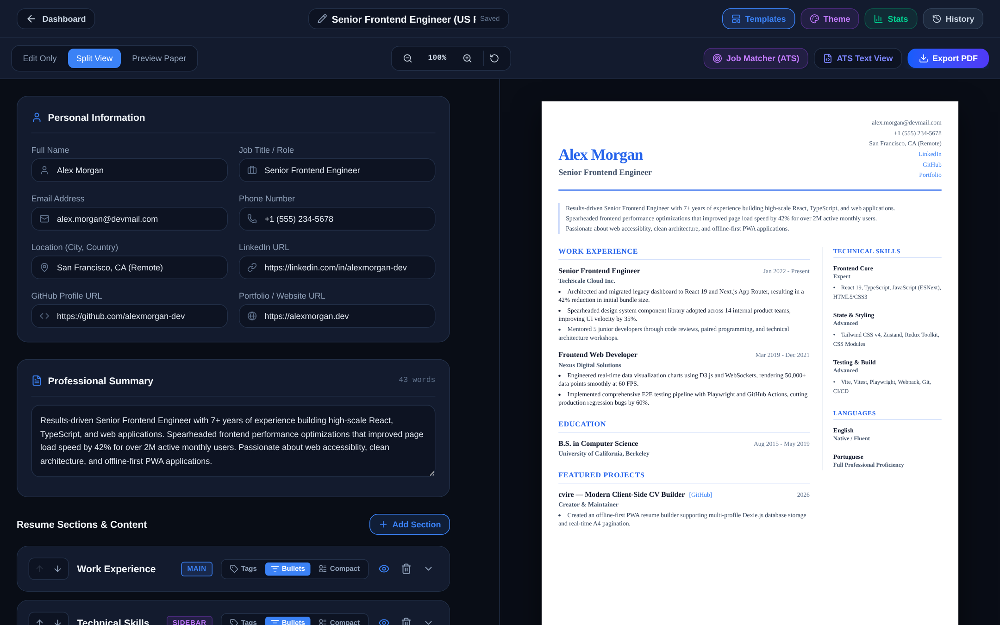
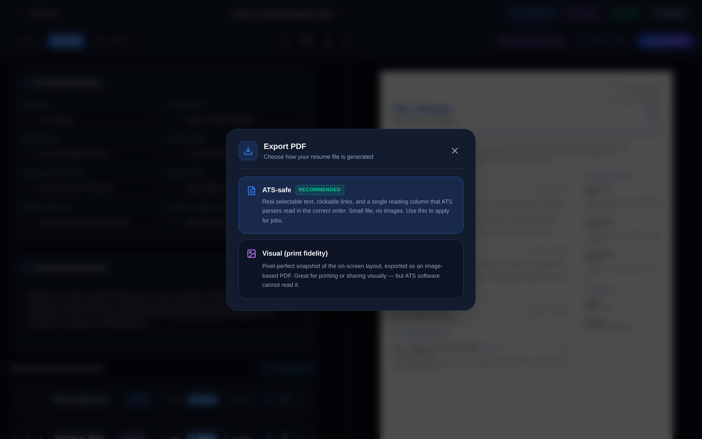
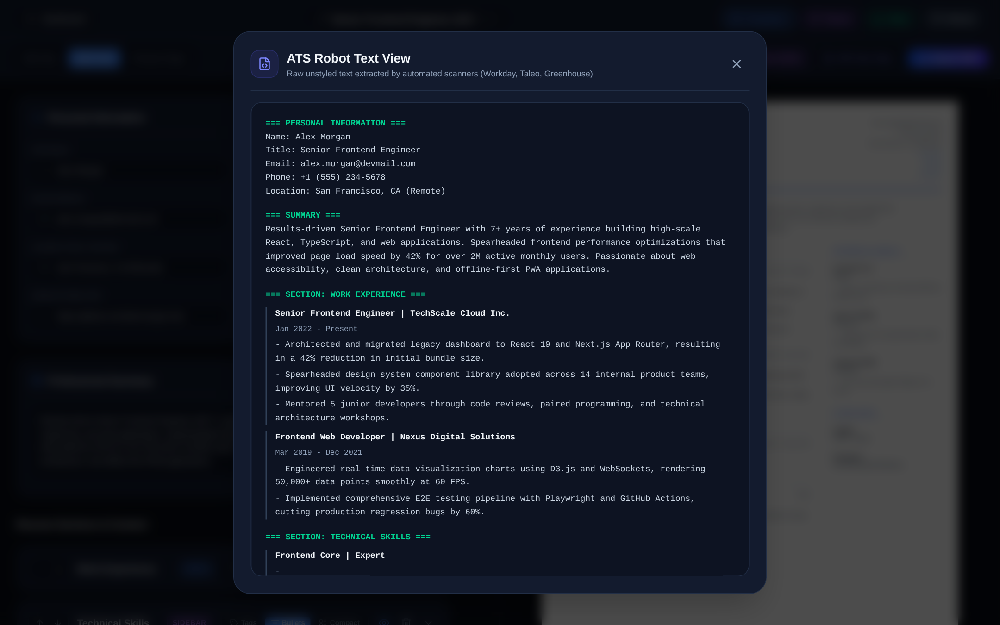

<div align="center">
  <br />
  <h1>cvire</h1>
  <p><strong>A client-side, offline-first resume builder designed for structured resume creation, ATS optimization, and precise A4 pagination.</strong></p>

  [](https://github.com/djlabz/cvire/actions/workflows/ci.yml)
  [](https://github.com/djlabz/cvire/actions/workflows/auto-deploy.yml)
  [](https://react.dev)
  [](https://www.typescriptlang.org/)
  [](https://vite.dev)
  [](https://tailwindcss.com)
  [](https://dexie.org)
  [](LICENSE)

  <p><a href="https://djlabz.github.io/cvire/"><strong>▶ Live demo (GitHub Pages)</strong></a></p>

  <br />
</div>

---

## Overview

cvire runs entirely in the browser using IndexedDB for local persistent storage. Resume data, version history, and API keys remain encrypted on the user's device, requiring no backend services or external data tracking.

## Screenshots

**Dashboard** — multi-profile management; every resume lives in the browser's IndexedDB.



**Editor & live A4 preview** — split view with real-time page-cut lines at every A4 boundary.



| Export modes | ATS text view |
|---|---|
|  |  |

The screenshots are generated from the running app, not hand-edited — regenerate them with:

```bash
npm run capture:media
```

That builds the app, boots `vite preview`, drives it with Playwright at a fixed viewport, and rewrites `docs/media/`. Set `CVIRE_URL` to capture against an app you already have running.

---

## PDF Export: two modes, on purpose

cvire exports resumes in two distinct modes, selectable at export time:

### ATS-safe (recommended)
Text-native PDF generated with `@react-pdf/renderer`:

- **Real selectable text** with embedded fonts — no raster images, no hidden layers.
- **Real `/URI` link annotations** for email, LinkedIn, GitHub, portfolio, and project links, with the URLs also spelled out as visible text.
- **Guaranteed reading order**: header → sections in document order, in a single reading column. Templates with an on-screen sidebar are linearized, which is exactly what positional ATS parsers (pdftotext, Workday, Taleo, Greenhouse) need to avoid interleaving columns.
- **Keep-together pagination**: a section title or item header never ends a page orphaned from its first content line.
- **PDF metadata** (title, author, subject, keywords) derived from the profile.
- Tiny files: the demo profile exports at ~7KB.

### Visual (print fidelity)
Pixel-perfect raster of the on-screen layout (html2canvas-pro + jsPDF) with smart A4 page cuts. Ideal for printing and visual sharing. This mode is **honestly visual-only**: it contains no text layer at all. (Earlier versions injected invisible white text over the image — the exact pattern ATS fraud detectors flag as "white fonting"; that layer has been removed.)

Why both? Because a pretty PDF that silently fails ATS parsing costs interviews. The export dialog explains the trade-off and recommends ATS-safe for job applications.

Every commit is gated by `npm run verify:ats`, which fails if the ATS-safe export ever ships without link annotations, with raster content, with invisible text, or with a broken reading order.

---

## Technical Specifications & Features

### Multi-Profile Management
- **IndexedDB Relational Storage**: Local storage for resume profiles, versions, and settings using Dexie.js.
- **Search & Filtering**: Search profiles by title or candidate name with filters for favorites, archived items, and locale (`en-US` and `pt-BR`).
- **Data Mobility**: Batch export and import of all user profiles into a unified JSON backup file.

### Paginated A4 Canvas
- **Physical A4 Rendering**: Scaled canvas matching physical A4 dimensions (`210mm x 297mm` / `794px x 1123px` at 96 DPI).
- **Page Break Indicators**: Real-time height monitoring that renders visual indicators at page split boundaries to prevent line truncation across printed pages.
- **Viewport Controls**: Support for zooming (50% to 150%) and multiple view modes (*Edit Only*, *Split View*, *Preview Paper*).

### ATS Engine & Diagnostics
- **Weighted ATS Scoring**: Evaluates resumes against six weighted metrics:
  - Structure & Formatting (20%)
  - Technical Keywords (25%) — continuous density/diversity scoring over a curated technology dictionary
  - Quantified Metrics (20%)
  - Action Verbs (15%)
  - Summary & Length (10%)
  - Contact Information (10%)
- **Resume Linter**: Real-time diagnostic checks identifying anti-patterns, overused terms, missing metrics, and low keyword coverage.
- **Plain Text Parser View**: Simulates raw text extraction used by Applicant Tracking Systems (Workday, Taleo, Greenhouse).

### Security & Optional AI Integration
- **Web Crypto Key Storage**: Local API keys (Google Gemini) are encrypted with 256-bit AES-GCM via the Web Crypto API. The non-extractable master key is persisted in IndexedDB, so stored keys remain decryptable across sessions.
- **AI Enhancement**: Optional STAR-format bullet point rewriter powered by Gemini 2.5 Flash (bring your own key).

### Job Description Matcher
- **TF-IDF Keyword Matching**: Log-normalized term frequency weighted by inverse document frequency over an embedded corpus of job descriptions, with cosine similarity between the resume and the target posting. Surfaces the posting's most distinctive keywords and flags which ones are missing from the resume. Fully offline.

### Template Engine & Customization
- **Five Pre-built Layouts**:
  - `Modern Tech`: Two-column layout with technical skill sidebar.
  - `Executive Classic`: Traditional single-column layout for senior leadership.
  - `Minimalist Clean`: Spaced single-column layout prioritizing typography.
  - `Creative Accent`: Header banner layout for design and creative roles.
  - `Compact Single-Page`: High-density layout engineered to condense experience onto one page.
- **Styling Controls**: Theme color selection, Google Fonts integration (*Inter, Roboto, Merriweather, Fira Code, Outfit, Poppins*), font scale, and line-height controls.

### Versioning & Side-by-Side Comparison
- **Version Checkpoints**: Create manual snapshots with commit notes and restore prior versions on demand.
- **Comparison Engine**: Dual-pane comparison interface showing score differentials, word counts, and section-by-section metrics between two resumes.

---

## Tech Stack

- **Frontend Framework**: React 19, TypeScript 6, Vite 8
- **Styling**: Tailwind CSS v4, CSS Variables, Lucide React Icons
- **Local Database**: Dexie.js (IndexedDB wrapper)
- **State Management**: Zustand
- **Export Engines**: `@react-pdf/renderer` (ATS-safe, text-native) and `html2canvas-pro` + `jspdf` (visual print fidelity)
- **Security**: Web Crypto API (`SubtleCrypto` AES-GCM 256-bit, non-extractable persisted key)
- **AI SDK**: `@google/genai`
- **Internationalization**: `i18next`, `react-i18next`

---

## Content workflow

Resume **content orchestration** lives under [`cv-content/`](cv-content/), separate from [`.agents/skills/`](.agents/skills/) (engineering agent skills).

1. **Attach a resume** — agents must start with intake ([`cv-intake.md`](cv-content/prompts/cv-intake.md)): translate, adapt to cvire/ATS, start from scratch, optimize for a job, or metrify/statistics (option E → board).
2. **Work prompts** — [`cv-analyzer`](cv-content/prompts/cv-analyzer.md) / [`cv-adapter`](cv-content/prompts/cv-adapter.md) / [`cv-translate`](cv-content/prompts/cv-translate.md) / [`cv-report-board`](cv-content/prompts/cv-report-board.md) (option E)
3. **Integrity** — [`content-integrity.md`](cv-content/rules/content-integrity.md) (no invented experience or tech)
4. **Outputs** — JSON [`outputs/json/`](cv-content/outputs/json/), pretty ATS summary [`outputs/md/`](cv-content/outputs/md/), metrics board [`outputs/html/`](cv-content/outputs/html/)
5. **Closing board** — overall score + improvement plan via [`cv-report-board.md`](cv-content/prompts/cv-report-board.md); archive prior versions to `outputs/dump/`; **ask HTML vs Canvas and open**; preview with `npm run serve:cv-board`
6. **Import + PDF** — load JSON in the app → Export PDF (ATS-safe or Visual); optional copy under [`outputs/pdf/`](cv-content/outputs/pdf/)
7. **DOCX** — [`outputs/docx/`](cv-content/outputs/docx/) reserved for Word files (no in-app generator yet)

See [`cv-content/README.md`](cv-content/README.md) and [`AGENTS.md`](AGENTS.md) for agent-facing detail.

---

## Installation & Setup

### Prerequisites
- Node.js 18.0.0 or higher
- npm 9.0.0 or higher

### Local Development
```bash
# Clone the repository
git clone https://github.com/djlabz/cvire.git
cd cvire

# Install dependencies
npm install

# Start the development server
npm run dev

# Build for production
npm run build
```

### Quality gates
```bash
npm run lint        # oxlint
npm test            # unit tests (page cuts, crypto vault, ATS engine, job matcher)
npm run verify:ats  # headless ATS-safety checks on the text-native export
npm run smoke:pdf   # browser smoke test of both export modes (needs `npm run dev` running)
```

### Docs
```bash
npm run capture:media  # regenerate the README screenshots in docs/media/
```

---

## License

MIT License. See [`LICENSE`](LICENSE) for details.
